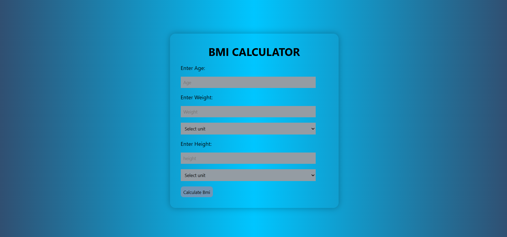

# 🏋️‍♀️ BMI Calculator

 
 
 

A simple **BMI (Body Mass Index) Calculator** built with **HTML, CSS, and JavaScript**. This interactive tool calculates your BMI based on your age and provides health insights.

---

## 🚀 Live Demo
🔗 [**View Project Here**](https://ANAGHA-A-04.github.io/BMI-calculator/)

---

## 📸 Preview

---

## ✨ Features
✅ Enter your age to calculate BMI  
✅ User-friendly interface and responsive design  
✅ Displays BMI category: Underweight, Normal, Overweight, Obese  
✅ Deployed on GitHub Pages for easy access  

---

## 🛠️ Built With
- HTML5
- CSS3
- JavaScript
- 💻 Deployed on GitHub Pages

---

📌 Author
👩‍💻 Anagha A
🌐 GitHub
